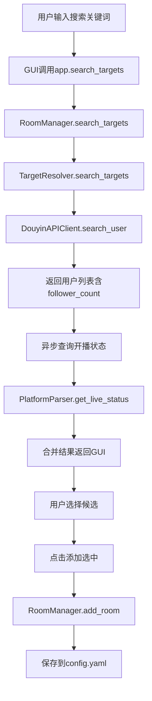

## 产品概述

优化直播录制系统的搜索添加直播间功能,提供类似普通视频搜索的用户体验,简化操作流程。

## 核心功能

- 搜索结果显示主播名称、平台ID、粉丝数、开播状态四个核心字段
- 粉丝数量以友好格式显示(如12.3万)
- 支持实时查询开播状态
- 选中候选后点击"添加选中"按钮一键添加直播间

## 技术栈

- **编程语言**: Python 3.x
- **GUI框架**: tkinter + ttkbootstrap
- **网络请求**: requests
- **配置管理**: PyYAML
- **现有架构**: 保持分层架构,复用现有模块

## 实现方案

### 核心策略

采用渐进式改进策略,在现有架构基础上增强功能:

1. 后端增强: 扩展数据模型,增加粉丝数和开播状态字段
2. 前端优化: 重构搜索对话框UI,优化列布局和交互
3. 数据流优化: 异步查询开播状态,提升用户体验

### 关键技术决策

**数据增强方案**

- 在`target_resolver.py`中扩展返回字典,新增`follower_count`和`is_live`字段
- 复用`api_client.py`已有的`follower_count`字段
- 利用`platform_parser.py`的`get_live_status()`方法实时查询开播状态
- 使用线程池并发查询多个候选的开播状态,避免阻塞UI

**粉丝数格式化**

- 创建工具函数`format_follower_count()`,将数字转换为友好显示(如123456 -> 12.3万)
- 支持万、百万级别的显示(10000 -> 1万, 1000000 -> 100万)

**UI重构方案**

- 保持现有对话框框架,优化`_on_add_by_query()`方法
- Treeview列配置: 昵称(220px)、平台ID(120px)、粉丝数(120px)、开播状态(100px)
- 开播状态使用不同颜色标识:在线(绿色)、离线(灰色)
- 简化操作流程:搜索→选中→添加按钮,取消多余配置项

**性能优化**

- 搜索结果返回后,异步查询开播状态
- 使用ThreadPoolExecutor并发查询,超时时间5秒
- 查询失败时显示"未知"状态,不阻塞整体流程

### 实现细节

#### 文件修改清单

**1. target_resolver.py** [MODIFY]

- 修改`search_targets()`方法返回值,增加`follower_count`和`is_live`字段
- 新增`_query_live_status()`私有方法,批量查询开播状态
- 复用DouyinAPIClient已获取的follower_count字段

**2. api_client.py** [MODIFY]

- 验证`search_user()`方法返回的follower_count字段完整性
- 确保数据正确传递到target_resolver

**3. gui.py** [MODIFY]

- 新增`_format_follower_count()`静态方法,格式化粉丝数显示
- 重构`_on_add_by_query()`方法,优化对话框布局:
- 简化输入区:保留平台、搜索框,移除可选名称输入
- 优化列表区:更新列定义,显示昵称、平台ID、粉丝数、开播状态
- 简化操作区:保留搜索、取消、添加选中按钮
- 增强`render_candidates()`方法,添加开播状态颜色标识

**4. utils.py** [NEW]

- 新增工具函数模块,包含:
- `format_follower_count(count: int) -> str`: 格式化粉丝数
- `get_live_status_color(is_live: bool) -> str`: 获取开播状态颜色标识

### 架构设计

#### 数据流图



### 目录结构

```
a:/coding/socialmedia_cut/
├── gui.py                      # [MODIFY] 重构_on_add_by_query方法,优化搜索UI
├── target_resolver.py           # [MODIFY] 扩展search_targets返回粉丝数和开播状态
├── api_client.py               # [MODIFY] 确认follower_count字段传递
├── utils.py                   # [NEW] 工具函数模块(粉丝数格式化等)
└── tests/
    └── test_utils.py           # [NEW] 工具函数单元测试
```

### 关键代码结构

```python
# utils.py - 新增工具函数
def format_follower_count(count: int) -> str:
    """格式化粉丝数为友好显示"""
    if count >= 100000000:
        return f"{count / 100000000:.1f}亿"
    elif count >= 10000:
        return f"{count / 10000:.1f}万"
    return str(count)

def get_live_status_color(is_live: bool) -> str:
    """获取开播状态标识颜色"""
    return "green" if is_live else "gray"
```

```python
# target_resolver.py - 修改search_targets返回值
def search_targets(self, platform: str, query: str, limit: int = 20) -> List[Dict]:
    # ...现有逻辑...
    candidates = [{
        "platform": "douyin",
        "room_id": str(uid),
        "nickname": user.get("nickname", ""),
        "uid": str(uid),
        "source": "name",
        "follower_count": user.get("follower_count", 0),  # 新增
        "is_live": None  # 后续异步查询
    } for user in users]
    
    # 异步查询开播状态
    self._enrich_with_live_status(candidates)
    return candidates
```

```python
# gui.py - 优化Treeview列配置
result_tree = ttk.Treeview(result_box, columns=columns, show="headings")
columns = ("nickname", "room_id", "follower_count", "is_live")
result_tree.heading("nickname", text="主播名称")
result_tree.heading("room_id", text="平台ID")
result_tree.heading("follower_count", text="粉丝数")
result_tree.heading("is_live", text="开播状态")
```

## 设计风格

采用现代深色科技风格,与现有cyborg主题保持一致,优化搜索对话框的视觉层次和交互体验。

## UI布局设计

### 对话框总体布局

- 尺寸: 780x480(保持现有)
- 主题: cyborg深色主题
- 布局: 网格布局,3行4列结构

### 第一行: 搜索输入区

- 平台选择: 下拉框,显示抖音/哔哩哔哩/斗鱼
- 搜索框: 输入框,支持主播名称/ID/URL
- 搜索按钮: 蓝色主按钮,触发搜索
- 取消按钮: 灰色次按钮,关闭对话框

### 第二行: 候选列表区

- 标签框: "搜索结果",左对齐
- Treeview表格: 4列布局
- 主播名称: 220px,左对齐,显示昵称
- 平台ID: 120px,居中对齐,显示数字ID
- 粉丝数: 120px,右对齐,显示格式化数字
- 开播状态: 100px,居中对齐,使用颜色标识
- 滚动条: 垂直滚动条,跟随列表

### 第三行: 底部操作区

- 状态提示: 左侧显示搜索结果数量或错误信息
- 添加按钮: 绿色主按钮,"添加选中",禁用状态直到选中
- 取消按钮: 灰色次按钮,关闭对话框

### 交互设计

- 搜索后自动选中第一个候选
- 悬停高亮行效果
- 选中状态使用primary背景色
- 开播状态实时颜色更新
- 按钮状态动态禁用/启用

## 颜色系统

- 主色调: #2c3e50(深蓝灰背景)
- 强调色: #3498db(蓝色,主按钮)
- 成功色: #27ae60(绿色,在线状态/添加按钮)
- 禁用色: #95a5a6(灰色,离线状态/禁用按钮)
- 文本色: #ecf0f1(浅灰白文字)

## 字体系统

- 标题: Microsoft YaHei UI, 10px, Bold
- 正文: Microsoft YaHei UI, 9px, Regular
- 数字: Consolas, 10px, Regular(用于ID和粉丝数)

# Agent Extensions

无相关Agent Extensions需要使用。